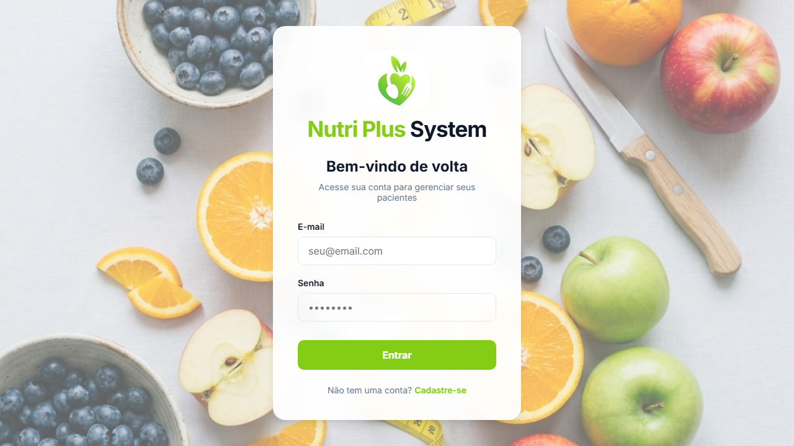

# 🍏 Sistema Nutricionista Inteligente (Nutri Plus System)

Bem-vindo ao **Nutri Plus System**, uma plataforma moderna e completa para nutricionistas gerenciarem seus pacientes e gerarem planos alimentares dinâmicos utilizando Inteligência Artificial.

🔗 **Acesse o projeto em produção:** [nutri-plus-system.vercel.app](https://nutri-plus-system.vercel.app/)

## 📸 Preview do Projeto

## 🚀 Como o projeto foi desenvolvido

O projeto foi construído focando em performance, segurança e uma excelente experiência de usuário, dividindo a arquitetura em três frentes principais:

### 1. Frontend (Interface e Interatividade)
O visual da aplicação foi desenhado de forma responsiva utilizando **HTML, CSS Vanilla e JavaScript puro**, orquestrados pela rapidez do **Vite**. 
Para otimizar o fluxo, o sistema é arquitetado como uma **Single Page Application (SPA)**, gerenciando rotas sem precisar recarregar a página inteira. A visualização de métricas (como evolução de peso) foi implementada usando a biblioteca de gráficos **Chart.js**.

### 2. Integração Backend e IA (Serverless)
A grande estrela do sistema é a geração automatizada de dietas. Os dados coletados (objetivos, restrições, nível de atividade) são eviados do front-end para uma API Node.js/Express (preparada para rodar como **Serverless Function** na Vercel).
Essa API conecta-se diretamente com o modelo de inteligência artificial **Google Gemini**. O Backend constrói um "prompt" com os dados do paciente e solicita um cardápio semanal completo. Para evitar problemas no sistema, a biblioteca **Zod** processa a resposta da IA e valida se o formato JSON entregue obedece às nossas regras (7 dias, 5 refeições, 3 opções cada) antes de salvar no sistema. 

### 3. Banco de Dados, Persistência e Segurança (Supabase)
Toda a parte de login, armazenamento dos pacientes, históricos de consultas e planos de dieta fica no **Supabase** (banco PostgreSQL e Auth).
As **medidas de segurança** são altíssimas:
- Implementação de **Row Level Security (RLS)** nas tabelas do Supabase garantindo que nenhum nutricionista acesse dados de pacientes dos outros.
- As credenciais críticas e a chave do Gemini ficam escondidas atrás de `.env` nas variáveis de ambiente da provedora, garantindo proteção contra invasões através do Javascript do navegador.

## 🛠 Tecnologias Utilizadas
- **Core:** JavaScript Vanilla, Vite, Node.js
- **BaaS (Backend as a Service):** Supabase (Auth + Postgres)
- **IA Generativa:** API do Google Gemini
- **Ferramentas Adicionais:** Chart.js (Gráficos), Zod (Validação de schemas estritos)
- **Deploy:** Vercel
